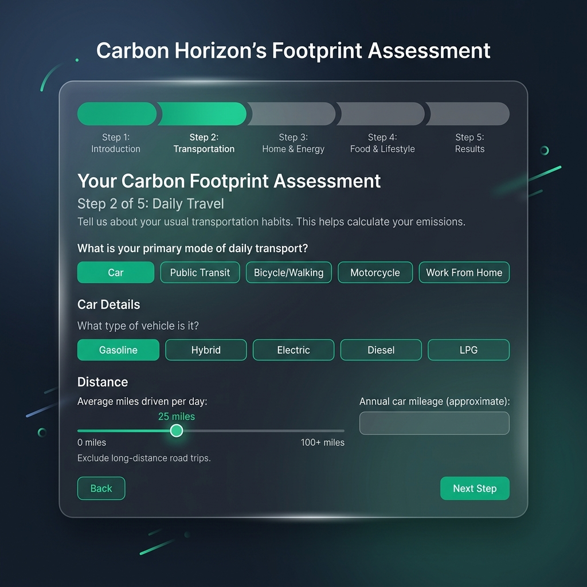
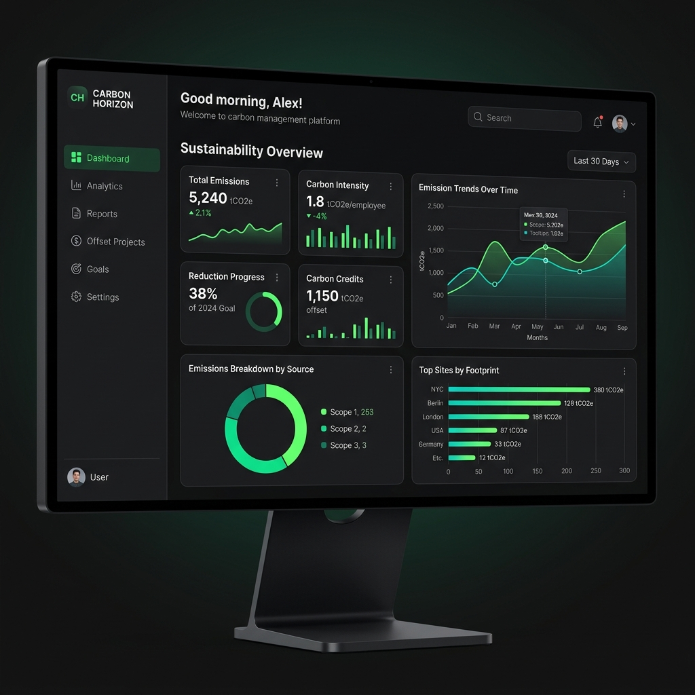
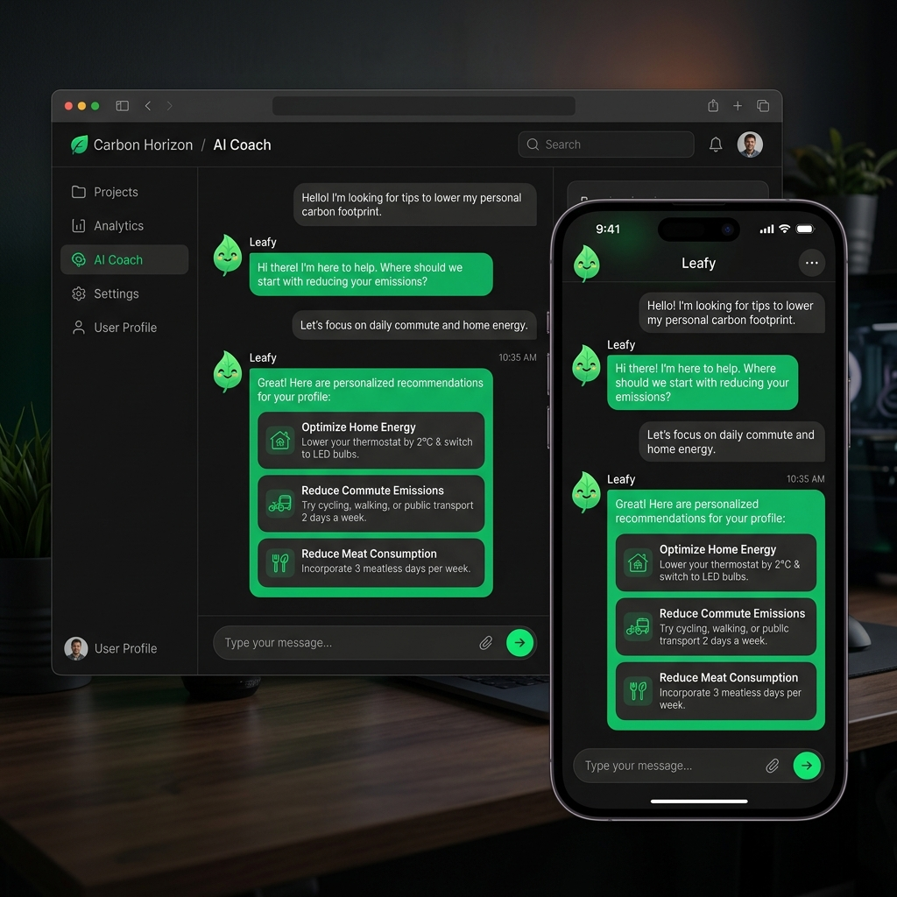
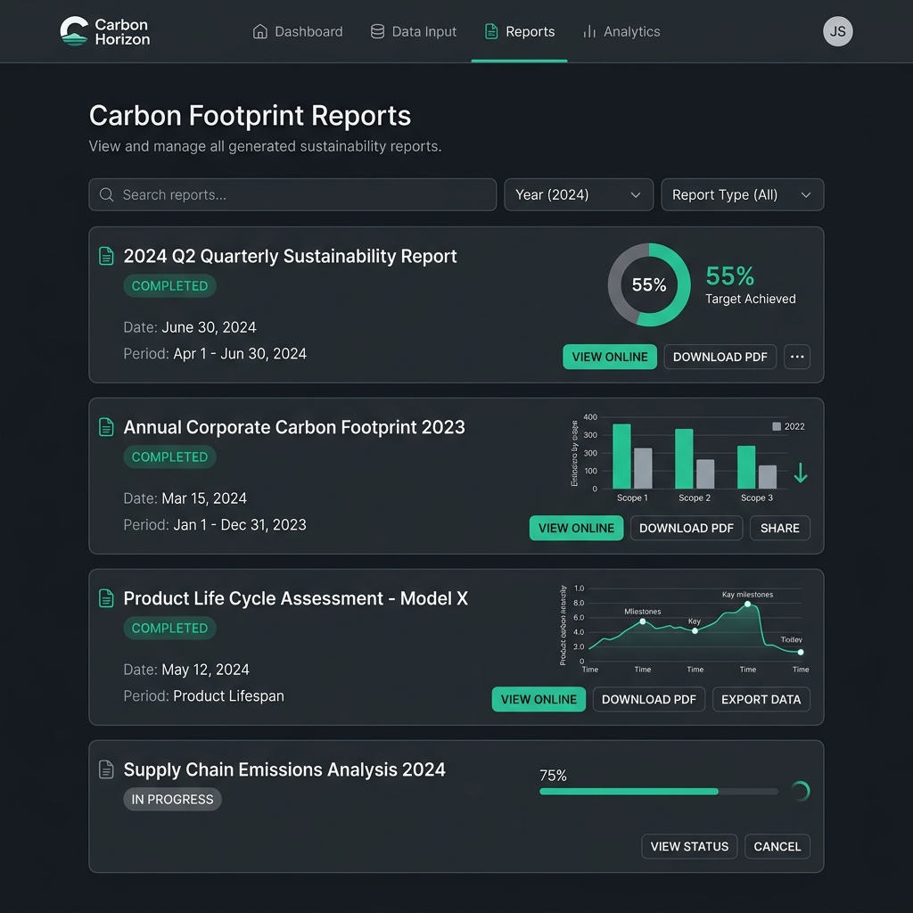

# Carbon Horizon
> Learn Your Impact. Shape the Future.

## Problem Statement
Global carbon literacy is low. Individuals lack accessible, personalized tools to understand their environmental impact and make actionable changes in their daily lives to combat climate change.

## Project Vision
Carbon Horizon is a personal sustainability intelligence platform designed to empower individuals by providing an accurate assessment of their carbon footprint, personalized AI-driven coaching, and tools to track sustainable habits and future impact.

## Competition Vertical
Sustainability & Climate Technology

## Architecture
React + TypeScript frontend → FastAPI backend → PostgreSQL → Gemini AI → Google Cloud Run

```text
+-------------------+       +--------------------+       +-------------------+
|   React + Vite    |       |    FastAPI         |       |    PostgreSQL     |
|   (TypeScript)    | <---> |    Backend         | <---> |    Database       |
+-------------------+       +--------------------+       +-------------------+
                                   ^     ^
                                   |     |
                       +-----------+     +-----------+
                       v                             v
               +---------------+             +----------------+
               |  Gemini AI    |             |  Google Cloud  |
               |  (Coach)      |             |  Run           |
               +---------------+             +----------------+
```

## Carbon Methodology
Sources: IPCC, EPA, IEA  
Formula: Carbon Emission = Activity Data × Emission Factor  
Example: 100 km car travel × 0.192 kg CO₂e/km = 19.2 kg CO₂e  
All calculations are version-tracked (calculation_version + factor_version stored per assessment).

## AI Coach Design
- Powered by Google Gemini API
- Scope: sustainability questions only — out-of-scope queries are redirected
- Personalization: responses use user's age group, city, country, diet, transport mode, and current footprint
- AI never performs carbon calculations — all math is backend-only (per Architectural Principle 2)

## How It Works
1. **Registration**: Create an account and set your baseline profile.
2. **Assessment**: Complete a dynamic questionnaire detailing your energy usage, diet, and travel habits.
   <br>
3. **Dashboard**: View your calculated carbon footprint, historical trends, and top emission sources in a beautifully visualized interface.
   <br>
4. **AI Coach**: Chat with the personalized sustainability coach to get actionable, context-aware advice on reducing your impact.
   <br>
5. **Simulator**: Adjust variables (e.g., changing diet or transport) to see how your footprint would change.
6. **Forecast**: View projections of your emissions based on current trends versus recommended changes.
7. **Habit Tracker**: Log daily eco-friendly actions (like taking public transit or recycling) and track your streak and carbon savings.
8. **Reports**: Monitor your achievements, streak milestones, and overall impact reduction over time.
   <br>

## Assumptions
- Carbon factors are sourced from IPCC/EPA and versioned
- Emission factors are not region-specific in MVP (global averages used)
- Forecast uses rule-based linear projection, not ML
- Water usage is tracked for habit purposes but not included in core CO₂ calculation in MVP

## Deployment Guide
### Prerequisites
- Node.js 18+
- Python 3.12+
- Google Cloud account
- Gemini API key

### Local Development

For the easiest setup, use the provided [docker-compose.yml](docker-compose.yml). First, configure your secrets:
```bash
cp .env.example .env
# IMPORTANT: Open .env and fill in real values. Never commit .env to version control!
docker-compose up -d
```

Otherwise, for manual setup:

#### Database Setup & Migrations
```bash
# Start PostgreSQL (if not using docker-compose)
docker run -d -p 5432:5432 -e POSTGRES_PASSWORD=password -e POSTGRES_DB=carbonhorizon postgres:15

# Run Alembic Migrations
cd backend
python -m venv venv
source venv/bin/activate
pip install -r requirements.txt
cp .env.example .env
alembic upgrade head
```

#### Backend API
```bash
cd backend
source venv/bin/activate
uvicorn main:app --reload
```

# Frontend
cd frontend
npm install
cp .env.example .env.local   # fill in VITE_API_URL
npm run dev
```

### Production Deployment (Google Cloud Run)
1. **Containerize**: Ensure both `backend/` and `frontend/` have their respective `Dockerfile` configured.
2. **Push to Google Container Registry or Artifact Registry**:
```bash
gcloud builds submit --tag gcr.io/PROJECT-ID/carbon-horizon-backend ./backend
gcloud builds submit --tag gcr.io/PROJECT-ID/carbon-horizon-frontend ./frontend
```
3. **Deploy to Cloud Run**:
```bash
gcloud run deploy carbon-horizon-backend \
  --image gcr.io/PROJECT-ID/carbon-horizon-backend \
  --platform managed \
  --allow-unauthenticated \
  --set-env-vars="GEMINI_API_KEY=...,DATABASE_URL=..."

gcloud run deploy carbon-horizon-frontend \
  --image gcr.io/PROJECT-ID/carbon-horizon-frontend \
  --platform managed \
  --allow-unauthenticated
```
*Note: For production, use Google Secret Manager to securely mount `GEMINI_API_KEY`, `SECRET_KEY`, and `DATABASE_URL` directly into the container instance.*

## Secrets Management
Production deployments **must** use a managed secret store (e.g., Google Secret Manager, AWS Secrets Manager, HashiCorp Vault). Never bake environment variables into compose files or CI YAML. `cloudbuild.yaml` in this repository demonstrates how to bind Google Cloud Secret Manager values via `--set-secrets`.

## Remediation & Migration (For existing deployments)
If you previously deployed using the hardcoded credentials, take these steps immediately:
1. **Rotate PostgreSQL Password:** In your production database, rotate the password. Then update Secret Manager with the new password.
2. **Rotate SECRET_KEY:** Update your `SECRET_KEY` in Secret Manager. This will invalidate all currently issued JWT tokens, logging out active users. It's recommended to do this during a low-traffic window and communicate the change to users.
3. **Clean Git History (Optional but Recommended):** If this repository was ever public, scrub the "password" string from git history using BFG Repo-Cleaner:
   ```bash
   # Make sure you have backed up your repository first
   echo "password" > passwords.txt
   bfg --replace-text passwords.txt
   git reflog expire --expire=now --all && git gc --prune=now --aggressive
   git push --force
   ```
   *Note: This rewrites history. All collaborators must re-clone the repository.*

## Tests
```bash
cd backend
pytest tests/ -v --cov=app
```

## License
MIT
# trigger test

