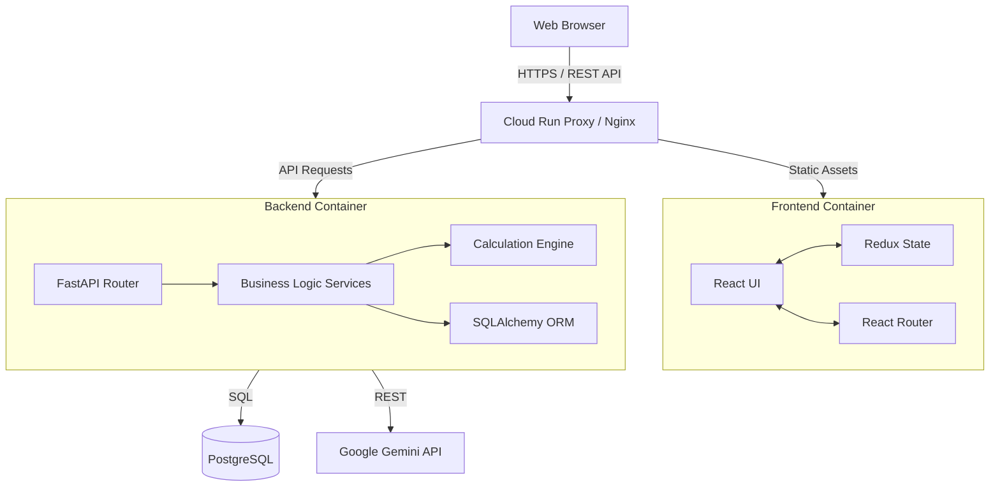
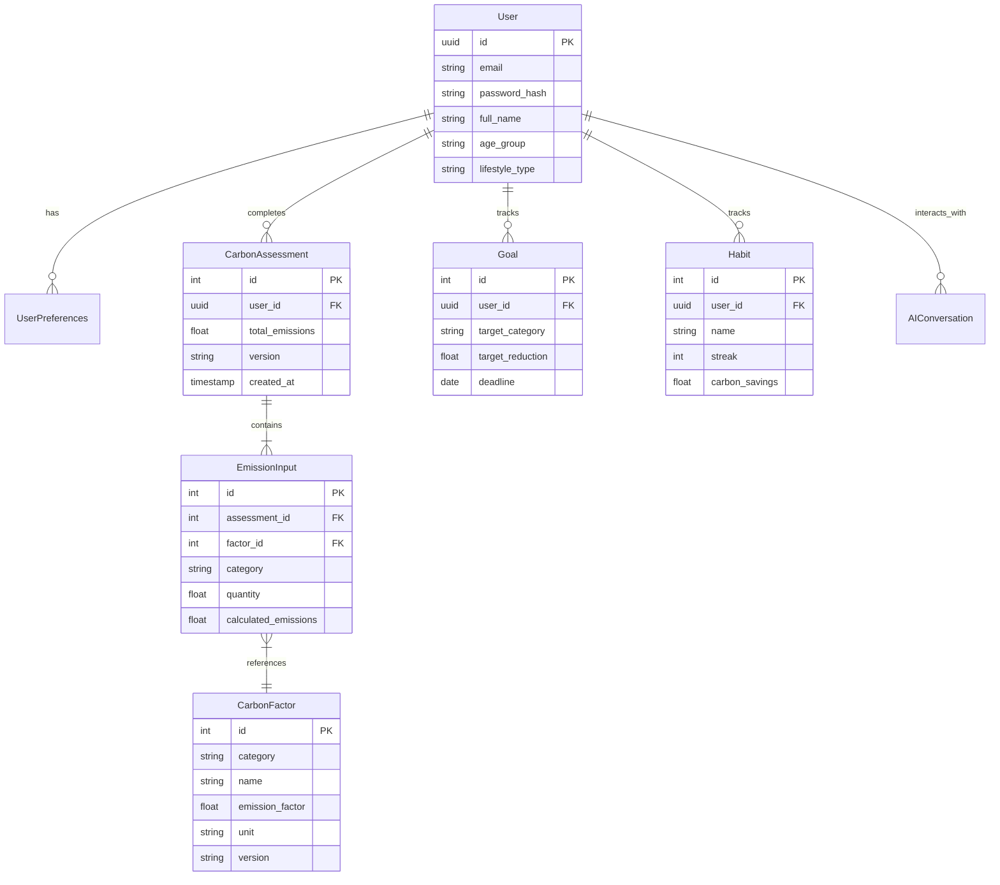

# Carbon Horizon Architecture

Carbon Horizon is designed as a modern, decoupled web application. The frontend is a Single Page Application (SPA) built with React, TypeScript, and Vite. The backend is a high-performance RESTful API powered by FastAPI, interacting with a PostgreSQL database.

## System Architecture

The following diagram illustrates the high-level architecture of Carbon Horizon:

## Database Entity-Relationship (ER) Diagram

The system stores users, carbon factors, assessments, and historical data. Below is the simplified ER diagram for the primary domain models:

## Component Interactions

1. **User Authentication**: JWT-based authentication. The React frontend stores the access token in memory (via AuthContext/Redux) and handles refreshing using an Axios interceptor to ensure seamless sessions.
2. **Carbon Calculation**: When a user submits an assessment form, the frontend passes raw input data to the FastAPI backend. The `CalculationEngine` fetches the corresponding `CarbonFactor`s and multiplies inputs by emission factors, returning an aggregate breakdown to the frontend.
3. **AI Coaching**: Real-time interactions are routed to the `coach_service`. This service appends the user's current context (age, recent footprint, active goals) into a system prompt before querying the Google Gemini API, ensuring highly personalized advice.

## Infrastructure & Deployment

The application is containerized using Docker. In production:
- **Google Cloud Run** serves both the Frontend (via Nginx or a static adapter) and the Backend API.
- **Cloud SQL** hosts the highly-available PostgreSQL instance.
- **GitHub Actions** automates continuous integration (running `flake8`, `pytest`, `vitest`) and deployment.
